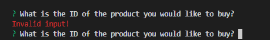
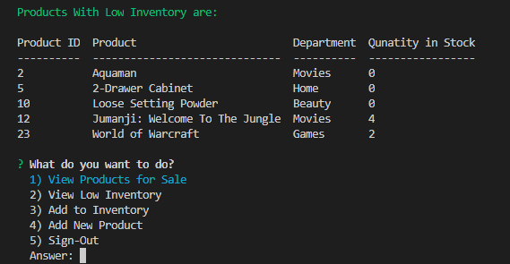
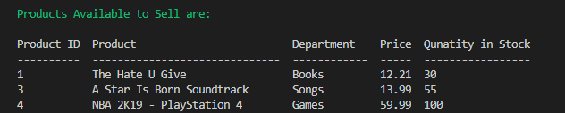

# bamazon-app

### Overview

This app can be used by a customer, manager, and supervisor.

- The customer, can purchase a product.

- The manager can view products for sale, view low inventory, add to inventory, and add new product.

- The supervisor can view product sales by department and create new department.

1. **When the customer is using the app**

- He can access the app by typing the following command:

```node bamazonCustomer.js```

As soon as he runs the app, he will be asked if he is ready to start shopping. 


- If he choose "No" the app will be terminated.


- If he choose "Yes" the app will display a table of products available for sale and the customer will be asked about the ID of the product he would like to purchase.


- If the user clicked enter without typing anything, he will get an error message and he will be asked againg to enter the product's ID.



- If the user typed a letter (not a number), he will get an error message and he will be asked againg to enter the product's ID.


- If the user typed a number that is out of the ID's range, he will get an error message and he will be asked againg to enter the product's ID.


- If the user typed a number that is within the ID's range, his input will be accepted and he will be asked about the quantity that he would like to purchase.


- The same as the product's ID, if the user inputs nothing or letter, he will get an error message, otherwise the amount that he has entered will be checked if it is available or not. If it is not available, the customer will be asked if he would like to purchase other item, if he choose "No" the app will be terminated, and if he choose "Yes" he will be asked again about the product's ID.


If the user inputs an amount that is available in the stock, he will be notified that his order has been placed successfuly and his total cost will be displayed. Also, user will be asked if he would like to purchase other item. If he choose "Yes" the same process will happen and if he choose "No" the app will be terminated.


The change will be reflected on DB


2. **When the manager is using the app**

- He can access the app by typing the following command:

```node bamazonManager.js```

As soon as he runs the command, he will be asked what does he want to do?


- If he choose "View Products for Sale" only the products with enough quantity in stock will be displayed.


and he will be offered the list again to choose other task:


- If he choose "View Low Inventory", all the products with quantities in stock less than 5 will be displayed, and he will be offered the list again to choose other task:



- If he choose "Add to inventory", a list of the available departments will be displayed and he will be asked to which one he would like to add:


Once he choose the department, a list of all of the products in that department will be displayed to choose to which one he would like to add ... NOTE: He can add to the products with low inventory and to any other product.


Once he choose the product, he will be asked about the amount he would like to add. A validation check will happen here too.


The change will be reflected on DB



- If he choose "Add New Product", he will be asked about the name of the product, to which department he would like to add this product, the price of this product (Validation again), and how many items of this product he want to add to the stock (Validation again)


The change will be reflected on DB


- If he choose to sign out, the app will be terminated:


2. **When the supervisor is using the app**

- He can access the app by typing the following command:

```node bamazonSupervisor.js```

As soon as he runs the command, he will be asked what does he want to do?


- If he choose to "View Product Sales by Department", he will get the following information: 


- If he choose to "Create New Department", he will be asked about the name of the department he want to create (Validation check), the ID of the department (Validation check), the over head costs (validation check):


The change will be reflected on DB


- If he choose to sign-out, the app will be terminated:


